# AI-SDLC Mind Matrix: Central Index

This document serves as the **Neural Hub** for the AI Standard Operating Procedures. It routes human and artificial agents to the correct governance nodes.

## 🧠 Operations Map

```mermaid
graph TD
    %% Core Management
    PMO[1000: AI Program Mgmt] --> DOC[1001: Document Gov]
    PMO --> CAP[1002: Capacity Mgmt]
    PMO --> CONF[1003: Config Mgmt]
    PMO --> PROC[1004: Procurement]
    PMO --> PLAN[1005: Release Planning]
    PMO --> IRB_ENG[1006: IRB Engagement]
    
    %% Operations & Support
    PMO --> AM[1007: Asset Mgmt]
    PMO --> INC[1008: Incident Mgmt]
    PMO --> DRIFT[1009: Model Drift]
    PMO --> MON[1010: Site Monitoring]
    PMO --> EOL_F[1011: Feature Decom]
    PMO --> XAI_P[1012: Post-Prod XAI]
    PMO --> VAL_P[1013: Post-Prod Val]
    PMO --> VER[1014: Compliance Ver]
    PMO --> KT[1015: Knowledge Transfer]
    
    %% Lifecycle
    LIF[1020: Model Lifecycle] --> REQ[1040: Requirements]
    REQ --> SEC[1050: Security Admin]
    SEC --> SLA[1060: SLA]
    SLA --> TRK[1061: Incident Tracking]
    
    %% Development
    DEV[1200: Development] --> QUAL[1210: Quality]
    QUAL --> DEP[1220: Deployment]
    
    %% AI Governance (The Cortex)
    IRB[1300: IRB Governance] --> BIAS[1301: Bias & Fairness]
    IRB --> XAI[1302: Transparency]
    IRB --> PRIV[1303: Data Privacy]
    IRB --> VAL[1304: Validation]
    IRB --> ETH[1305: Ethical Risk]
    IRB --> SUN[1306: Sunset Process]

    %% Training
    TRN[1100: Doc Testing] --> TRN_D[1101: Training Docs]
    
    %% Records
    REC[2002: Quality Records]

    linkStyle default stroke-width:2px,fill:none,stroke:white;
```

---

## 📂 Document Repository

### 1000-Series: Management & Core Processes
| ID | Title | File Link |
| :--- | :--- | :--- |
| **SOP-1000** | AI Integrated Program & Project Management | [SOP-1000](file:///Users/bobstewart/dev/AI-SDLC-SOPs/sops/SOP-1000-01-AI_AI-Integrated-Program-and-Project-Management.md) |
| **SOP-1001** | Document Governance & AI-IRB Compliance | [SOP-1001](file:///Users/bobstewart/dev/AI-SDLC-SOPs/sops/SOP-1001-01-AI_Document-Governance-and-AI-IRB-Compliance.md) |
| **SOP-1002** | Capacity Management | [SOP-1002](file:///Users/bobstewart/dev/AI-SDLC-SOPs/sops/SOP-1002-01-AI_Capacity-Management.md) |
| **SOP-1003** | Configuration Management | [SOP-1003](file:///Users/bobstewart/dev/AI-SDLC-SOPs/sops/SOP-1003-01-AI_Configuration-Management.md) |
| **SOP-1004** | Procurement for AI Systems | [SOP-1004](file:///Users/bobstewart/dev/AI-SDLC-SOPs/sops/SOP-1004-01-AI_Procurement-and-Purchasing-for-AI-Enabled-Systems.md) |
| **SOP-1005** | Release Planning | [SOP-1005](file:///Users/bobstewart/dev/AI-SDLC-SOPs/sops/SOP-1005-01-AI_AI-Integrated-Release-Planning.md) |
| **SOP-1006** | AI-IRB Engagement | [SOP-1006](file:///Users/bobstewart/dev/AI-SDLC-SOPs/sops/SOP-1006-01-AI_AI-IRB-Engagement-and-Ethical-Review-Procedure.md) |
| **SOP-1007** | AI Asset Management | [SOP-1007](file:///Users/bobstewart/dev/AI-SDLC-SOPs/sops/SOP-1007-01-AI_AI-Asset-Management.md) |
| **SOP-1008** | Incident & Escalation Management | [SOP-1008](file:///Users/bobstewart/dev/AI-SDLC-SOPs/sops/SOP-1008-01-AI_AI-Incident-and-Escalation-Management.md) |
| **SOP-1009** | Model Drift & Re-Validation | [SOP-1009](file:///Users/bobstewart/dev/AI-SDLC-SOPs/sops/SOP-1009-01-AI_AI-Model-Drift-and-Re-Validation-Procedure.md) |
| **SOP-1010** | Site Monitoring | [SOP-1010](file:///Users/bobstewart/dev/AI-SDLC-SOPs/sops/SOP-1010-01-AI_AI-SDLC-Site-Monitoring-and-Incident-Management.md) |
| **SOP-1011** | Feature Decommissioning | [SOP-1011](file:///Users/bobstewart/dev/AI-SDLC-SOPs/sops/SOP-1011-01-AI_AI-Feature-Decommissioning-and-Model-Retirement.md) |
| **SOP-1012** | Model Explainability Procedure | [SOP-1012](file:///Users/bobstewart/dev/AI-SDLC-SOPs/sops/SOP-1012-01-AI_AI-Model-Explainability-and-Interpretability-Procedure.md) |
| **SOP-1013** | Post-Production Monitoring | [SOP-1013](file:///Users/bobstewart/dev/AI-SDLC-SOPs/sops/SOP-1013-01-AI_AI-Model-Post-Production-Monitoring-and-Ongoing-Validation.md) |
| **SOP-1014** | Compliance Verification | [SOP-1014](file:///Users/bobstewart/dev/AI-SDLC-SOPs/sops/SOP-1014-01-AI_Regulatory-and-Ethical-AI-Compliance-Verification.md) |
| **SOP-1015** | Knowledge Transfer | [SOP-1015](file:///Users/bobstewart/dev/AI-SDLC-SOPs/sops/SOP-1015-01-AI_AI-Knowledge-Transfer-and-Handover-Procedure.md) |
| **SOP-1020** | Model Lifecycle Management | [SOP-1020](file:///Users/bobstewart/dev/AI-SDLC-SOPs/sops/SOP-1020-01-AI_AI-Model-Lifecycle-Management.md) |
| **SOP-1030** | Ad-Hoc Reporting | [SOP-1030](file:///Users/bobstewart/dev/AI-SDLC-SOPs/sops/SOP-1030-01-AI_AI-Ad-Hoc-Reporting-Procedure.md) |
| **SOP-1040** | Requirements Definition | [SOP-1040](file:///Users/bobstewart/dev/AI-SDLC-SOPs/sops/SOP-1040-01-AI_Requirements-Definition.md) |
| **SOP-1050** | Security Administration | [SOP-1050](file:///Users/bobstewart/dev/AI-SDLC-SOPs/sops/SOP-1050-01-AI_AI-Security-Administration-and-Governance.md) |
| **SOP-1051** | Security Admin & Oversight | [SOP-1051](file:///Users/bobstewart/dev/AI-SDLC-SOPs/sops/SOP-1051-01-AI_AI-Security-Administration-and-Oversight.md) |
| **SOP-1052** | Model Lifecycle Oversight | [SOP-1052](file:///Users/bobstewart/dev/AI-SDLC-SOPs/sops/SOP-1052-01-AI_AI-Model-Lifecycle-Oversight-and-Governance.md) |
| **SOP-1053** | Ethical Risk Assessment | [SOP-1053](file:///Users/bobstewart/dev/AI-SDLC-SOPs/sops/SOP-1053-01-AI_Ethical-Risk-Assessment-and-Mitigation.md) |
| **SOP-1054** | Project Approvals | [SOP-1054](file:///Users/bobstewart/dev/AI-SDLC-SOPs/sops/SOP-1054-01-AI_AI-Regulated-Project-Approvals-and-Sponsorship.md) |
| **SOP-1055** | Computer System Controls | [SOP-1055](file:///Users/bobstewart/dev/AI-SDLC-SOPs/sops/SOP-1055-01-AI_Computer-System-Controls.md) |
| **SOP-1060** | Service Level Agreements | [SOP-1060](file:///Users/bobstewart/dev/AI-SDLC-SOPs/sops/SOP-1060-01-AI_Service-Level-Agreement.md) |
| **SOP-1061** | Incident Tracking | [SOP-1061](file:///Users/bobstewart/dev/AI-SDLC-SOPs/sops/SOP-1061-01-AI_Incident-Tracking.md) |

### 1100-Series: Training
| ID | Title | File Link |
| :--- | :--- | :--- |
| **SOP-1100** | Documentation of Training | [SOP-1100](file:///Users/bobstewart/dev/AI-SDLC-SOPs/sops/SOP-1100-01-AI_Documentation-of-Training.md) |
| **SOP-1101** | Training & Documentation | [SOP-1101](file:///Users/bobstewart/dev/AI-SDLC-SOPs/sops/SOP-1101-01-AI_Training-and-Documentation.md) |

### 1200-Series: Development
| ID | Title | File Link |
| :--- | :--- | :--- |
| **SOP-1200** | Development | [SOP-1200](file:///Users/bobstewart/dev/AI-SDLC-SOPs/sops/SOP-1200-01-AI_Development.md) |
| **SOP-1210** | Quality Function | [SOP-1210](file:///Users/bobstewart/dev/AI-SDLC-SOPs/sops/SOP-1210-01-AI_Quality-Function.md) |
| **SOP-1220** | Deployment | [SOP-1220](file:///Users/bobstewart/dev/AI-SDLC-SOPs/sops/SOP-1220-01-AI_Deployment.md) |

### 1300-Series: Governance & Ethics (The AI-IRB)
| ID | Title | File Link |
| :--- | :--- | :--- |
| **SOP-1300** | AI-IRB Governance | [SOP-1300](file:///Users/bobstewart/dev/AI-SDLC-SOPs/sops/SOP-1300-01-AI_AI-IRB-Governance-and-Oversight.md) |
| **SOP-1301** | Bias & Fairness | [SOP-1301](file:///Users/bobstewart/dev/AI-SDLC-SOPs/sops/SOP-1301-01-AI_AI-Bias-and-Fairness-Evaluation.md) |
| **SOP-1302** | Explainability | [SOP-1302](file:///Users/bobstewart/dev/AI-SDLC-SOPs/sops/SOP-1302-01-AI_AI-Explainability-and-Model-Transparency.md) |
| **SOP-1303** | Data Protection | [SOP-1303](file:///Users/bobstewart/dev/AI-SDLC-SOPs/sops/SOP-1303-01-AI_AI-Data-Protection-and-Privacy.md) |
| **SOP-1304** | Validation & Monitoring | [SOP-1304](file:///Users/bobstewart/dev/AI-SDLC-SOPs/sops/SOP-1304-01-AI_AI-Validation-and-Monitoring.md) |
| **SOP-1305** | Ethical Risk | [SOP-1305](file:///Users/bobstewart/dev/AI-SDLC-SOPs/sops/SOP-1305-01-AI_AI-Ethical-Risk-and-Impact-Assessment.md) |
| **SOP-1306** | End of Life / Sunset | [SOP-1306](file:///Users/bobstewart/dev/AI-SDLC-SOPs/sops/SOP-1306-01-AI_AI-End-of-Life-and-Sunset-Process.md) |

### 2000-Series: Records
| ID | Title | File Link |
| :--- | :--- | :--- |
| **SOP-2002** | Control of Quality Records | [SOP-2002](file:///Users/bobstewart/dev/AI-SDLC-SOPs/sops/SOP-2002-01-AI_Control-of-Quality-Records.md) |
