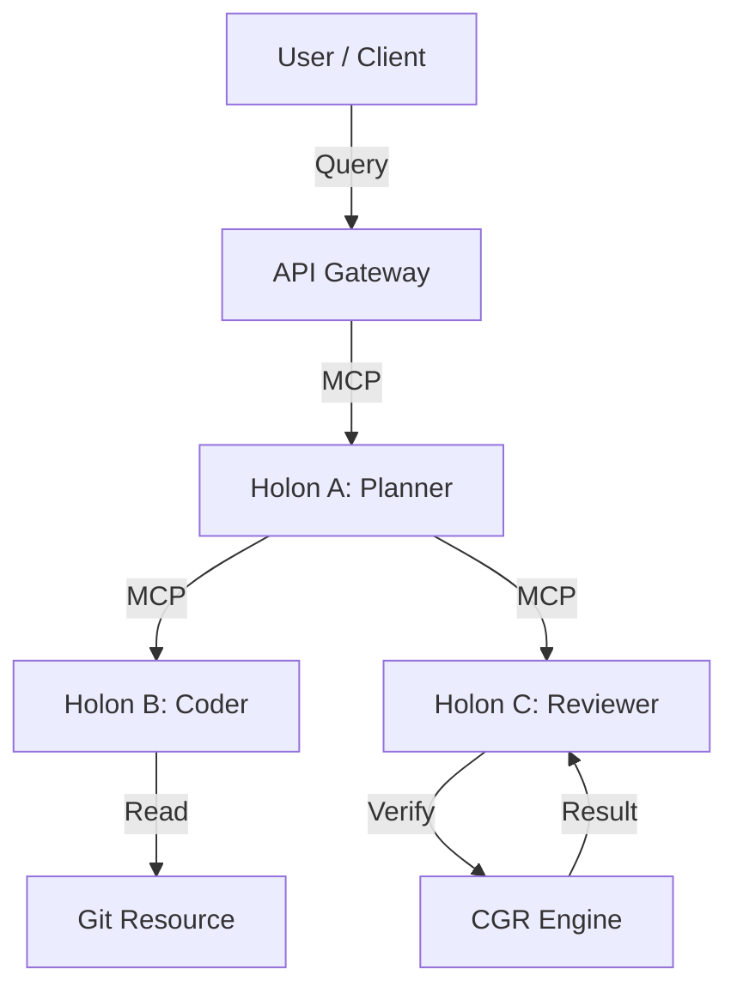

# Aeonsynthesis Architecture: The Global Nervous System

## Overview
Aeonsynthesis is the implementation of the Model Context Protocol (MCP) within the AEGIS ecosystem. It transforms isolated AI agents into "Holons"—entities that are simultaneously whole in themselves and parts of a larger whole.

## Core Concepts

### 1. The Holon
A Holon is a node in the network. It wraps an underlying AI model (LLM) or a data source with a standard interface.
*   **Input**: Context Streams (MCP Resources)
*   **Processing**: Recursive Synthesis (LLM Inference)
*   **Output**: Thoughts/Tools (MCP Prompts/Tools)

### 2. The Mesh
The Mesh is the topology of connected Holons. Unlike a rigid hierarchy, the Mesh is fluid. Holons connect peer-to-peer based on semantic relevance.
*   **Dynamic Routing**: A query is routed to the Holon best suited to answer it.
*   **Context Propagation**: Context flows through the graph, accumulating meaning.

### 3. The Protocol (MCP)
We utilize the open standard Model Context Protocol to ensure interoperability.
*   **Resources**: Read-only data exposed by a Holon (e.g., logs, code, memories).
*   **Prompts**: Standardized ways to query a Holon.
*   **Tools**: Executable functions exposed by a Holon.

## Architecture Diagram

## Implementation Strategy
1.  **Local First**: Every developer runs a local Holon (the "Sidecar") that learns from their personal context.
2.  **Federated Learning**: Local Holons sync insights (not raw data) to the Global Holon.
3.  **Recursive Optimization**: The Global Holon optimizes the prompts and weights of the Local Holons.
